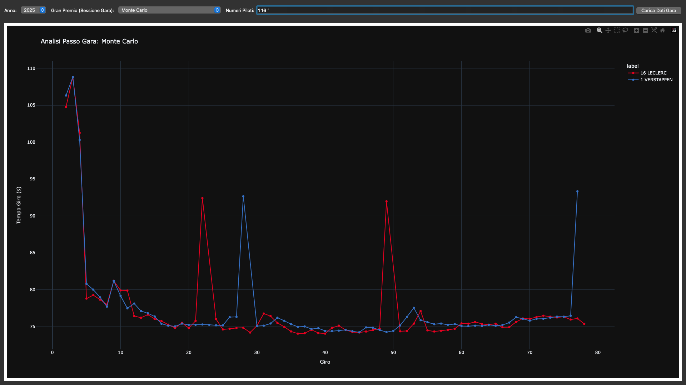

# Race-Pace-Graph

I developed a Race Pace Analyzer in Python using the OpenF1 API. The project allows users to compare race pace data across all drivers, race by race, from the 2023 season through 2025.

Example: 

